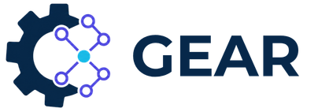

<p align="center">
  
</p>

<p align="center">
  Design portable multi-agent systems once, then generate implementations for multiple agent frameworks.
</p>

<p align="center">
  
  
  
  
</p>

## Overview

GEAR is a framework-independent design layer for multi-agent systems. A GEAR project describes agents, tasks, modules, execution order, memory, tools, and model settings without tying the source design to one execution runtime.

The same validated project can be converted into runnable Python implementations for:

| Target | Agents and tasks | Sequential workflow | Parallel and loop modules |
| --- | --- | --- | --- |
| CrewAI | Supported | Supported | Concurrent async crews and bounded loops |
| Google ADK | Supported | Supported | Supported through native workflow agents |
| LangGraph | Supported | Supported | Native graph branches and joins; bounded loop modules |
| OpenAI Agents SDK | Supported | Supported | Deterministic Python orchestration with tracing |
| Microsoft Agent Framework | Supported | Supported | Native fan-out and synchronized fan-in workflows |
| Strands Agents | Supported | Supported | Native graph branches, explicit fan-in barriers, and bounded loops |
| PydanticAI | Supported | Supported | Type-safe outputs, async parallel hand-offs, and bounded loops |
| Microsoft AutoGen | Supported | Supported | Parallel agent tasks and bounded round-robin teams |
| Semantic Kernel | Supported | Supported | Stable agent calls with deterministic async orchestration |
| Haystack | Supported | Supported | Native async agents, parallel hand-offs, and bounded loops |

Connector manifests and conversion reports remain authoritative for the installed version.

## Key capabilities

- Stable, versioned `.gear.yml` project format.
- Guided Studio for agents, modules, workflows, validation, and builds.
- Advanced YAML editing with a complete key and value reference.
- Blocking validation before artifact generation.
- Transactional multi-target conversion: no partial output when a requested target fails preflight.
- Runnable Python generation for every installed connector.
- Persistent build and execution history with build, run, and trace identifiers.
- Extensible connector architecture based on manifests, mappings, and assembler plugins.
- UVL feature models and Flamapy-based configuration analysis.

## How GEAR works

```text
GEAR project
    │
    ├── Agents and tasks
    ├── Parallel or loop modules
    └── Workflow graph
            │
            ▼
       Validation
            │
            │
            ▼
   Selected connectors
            │
            ▼
   Runnable Python artifacts
```

The source project stays unchanged. Connector-specific adaptations and unsupported properties are exposed in the conversion report instead of being silently discarded.

## Requirements

- Python `>=3.10,<3.14`
- Node.js `>=20` for the conversion backend and documentation
- An API key only when the generated workflow calls a hosted model

Framework runtimes are optional dependencies. They are not required to author or convert a project.

## Installation

```bash
python -m venv .venv
source .venv/bin/activate
python -m pip install --upgrade pip
pip install -e .
```

Install local execution runtimes only when needed:

```bash
pip install -e ".[execution]"
```

The combined extra installs the mutually compatible runtimes. A single target can be installed with its dedicated extra, for example:

```bash
pip install -e ".[execution-pydantic-ai]"
pip install -e ".[execution-microsoft-agent-framework]"
pip install -e ".[execution-autogen]"
pip install -e ".[execution-semantic-kernel]"
pip install -e ".[execution-haystack]"
```

The combined extra is dependency-resolved against CrewAI 1.15 and Google ADK 2.5. Google ADK is installed with LiteLLM instead of the broad `extensions` extra because that extra currently pins an older LangGraph branch. Dedicated target extras remain preferable for smaller execution environments.

For development and tests:

```bash
pip install -e ".[dev]"
npm ci
```

Verify the installation:

```bash
gear --version
gear connectors list
```

## First project

Create, validate, and convert a starter project:

```bash
gear init my-project
gear validate my-project.gear.yml
gear convert my-project.gear.yml --all-targets
```

To test GEAR with a complete project immediately, select one of the bundled one-, four-, five-, or six-agent starters:

```bash
gear templates list
gear init test-project --template research-team
gear init guided-project --interactive
```

`--provider` and `--model` make initialization fully scriptable when a particular LLM is required.

Once converted, set the provider API key and pass a test prompt through `GEAR_INPUT`:

```bash
gear convert test-project.gear.yml --target crewai
GEAR_INPUT="Prepare a short comparison of agent frameworks." \
  python dist/test-project/crewai/orchestration.py
```

Successful conversion writes target artifacts below:

```text
dist/my-project/
├── crewai/
│   ├── orchestration.py
│   └── build.json
└── adk/
    ├── orchestration.py
    └── build.json
```

Additional generated YAML and report files are stored beside each Python script.

If validation or connector preflight finds a blocking problem, conversion exits with status code `2`, prints every detected issue, and creates no new target files.

## Authoring projects in YAML

The stable project contract is defined by [`schemas/project.gear.schema.json`](schemas/project.gear.schema.json). Start with the documentation pages below instead of guessing keys from the implementation:

- [YAML overview](docs/yaml-reference.md)
- [Agent keys and values](docs/yaml-agent.md)
- [Module strategies](docs/yaml-module.md)
- [Workflow nodes and edges](docs/yaml-workflow.md)
- [Framework compatibility](docs/yaml-compatibility.md)
- [Complete YAML examples](docs/yaml-examples.md)

Validated, copy-ready project files are available in [`examples/`](examples/):

- [`minimal.gear.yml`](examples/minimal.gear.yml)
- [`sequential-three-agents.gear.yml`](examples/sequential-three-agents.gear.yml)
- [`parallel-module.gear.yml`](examples/parallel-module.gear.yml)
- [`parallel-aggregator.gear.yml`](examples/parallel-aggregator.gear.yml)
- [`loop-module.gear.yml`](examples/loop-module.gear.yml)

Names are references: module agent names must match `AgentIdentity.Name`, workflow `ref` values must match an agent or module name, and edge endpoints must match workflow node IDs.

## GEAR Studio

Start the web application:

```bash
gear serve
```

Then open:

- Guided Studio: <http://127.0.0.1:8200/>
- Classic editor: <http://127.0.0.1:8200/classic>

The Studio provides five guided stages:

1. Create agents through the essential form or advanced YAML.
2. Create parallel or loop modules.
3. Compose a mixed `Agent → Module → Agent` workflow by clicking or dragging components.
4. Resolve project and target-specific validation findings.
5. Select any installed framework, inspect the generated Python, and download or run it.

Agent provider and model are editable by default. To enforce one model across the Studio, set `GEAR_STUDIO_PROVIDER` and `GEAR_STUDIO_MODEL` in `.env`; leave `GEAR_STUDIO_MODEL` empty to allow per-agent choices. The server reapplies a locked policy during Studio builds.

On launch, the Studio can resume the local autosave, create an empty project, import a YAML/JSON project, or initialize any bundled starter. The **New project** button reopens this selector at any time.

### Trusted local execution

Browser-triggered execution is disabled by default. Enable it only for trusted local projects:

```bash
GEAR_ENABLE_LOCAL_RUNNER=true gear serve
```

The runner filters environment variables and applies CPU, memory, file-size, descriptor, and wall-time limits. These controls provide defense in depth for a trusted workstation; they are not a multi-tenant security sandbox.

## CLI reference

| Command | Purpose |
| --- | --- |
| `gear init <name>` | Create a starter `.gear.yml` project. |
| `gear templates list` | List ready-to-use starter projects. |
| `gear templates show <id>` | Preview a starter project. |
| `gear validate <project>` | Validate structure and references. |
| `gear inspect <project>` | Print the normalized project. |
| `gear convert <project> --target crewai` | Generate CrewAI artifacts. |
| `gear convert <project> --target adk` | Generate Google ADK artifacts. |
| `gear convert <project> --target langgraph` | Generate LangGraph artifacts. |
| `gear convert <project> --target openai-agents` | Generate OpenAI Agents SDK artifacts. |
| `gear convert <project> --target microsoft-agent-framework` | Generate Microsoft Agent Framework artifacts. |
| `gear convert <project> --target strands` | Generate Strands Agents artifacts. |
| `gear convert <project> --target pydantic-ai` | Generate PydanticAI artifacts. |
| `gear convert <project> --target autogen` | Generate Microsoft AutoGen artifacts. |
| `gear convert <project> --target semantic-kernel` | Generate Semantic Kernel artifacts. |
| `gear convert <project> --target haystack` | Generate Haystack artifacts. |
| `gear convert <project> --all-targets` | Preflight and generate every installed target. |
| `gear connectors list` | List installed connectors. |
| `gear connectors show <target>` | Inspect connector metadata. |
| `gear builds list` | List persistent conversion builds. |
| `gear builds show <id>` | Inspect one build. |
| `gear run <build-id>` | Execute a previously recorded local build. |
| `gear logs list` | List execution records. |
| `gear logs show <id>` | Inspect stdout, stderr, status, and trace metadata. |
| `gear serve` | Start the local Studio and API. |

Use the global `--json` option for machine-readable output. History is stored in `.gear/gear.db` by default and can be changed with `--store`.

## Secrets and environment

Create a local environment file from the template:

```bash
cp .env.example .env
```

Add model credentials only when executing generated code:

```dotenv
OPENAI_API_KEY=replace-with-your-key
```

Do not commit `.env` or place production secrets directly in a GEAR YAML project. Design, validation, conversion, and Python download work without an API key.

## Connectors

Connectors live under [`connectors/frameworks/`](connectors/frameworks/) and contain:

- `connector.yml`: identity, version, capabilities, and limitations;
- `*.mapping.yml`: explicit GEAR-to-target mappings;
- `assembly.plugin.js`: final artifact assembly;
- optional target templates and feature models.

[`connectors/registry.yml`](connectors/registry.yml) exposes connectors to the classic UI. The SDK loads the packaged connector manifests and runtime assets directly.

To add another target, start with [`connectors/frameworks/_template/`](connectors/frameworks/_template/) and follow the [connector authoring guide](connectors/README.md).

## Documentation

The VitePress site is published at <https://brellsanwouo.github.io/gear-framework/>.

Documentation is organized by user journey:

```text
Getting started
Configuration
Conversion and execution
Developer reference
Project
```

Run it locally:

```bash
npm ci
npm run docs:dev
```

Build or preview the production site:

```bash
npm run docs:build
npm run docs:preview
```

The displayed GEAR release is read from [`gear_sdk/version.py`](gear_sdk/version.py), which is also used by the package, CLI, API, and Studio.

## Repository structure

```text
gear-framework/
├── gear_sdk/                 Python SDK, CLI, conversion runtime, store, runner
├── gear_web/                 Flask Studio/API application
├── ui/                       Studio, classic editor, and static assets
├── gear/                     GEAR UVL models and YAML schemas
├── schemas/                  Stable project schema
├── connectors/               Framework manifests, mappings, generators, and template
├── examples/                 Validated project examples
├── docs/                     VitePress documentation source
├── tests/                    Python, JavaScript, and integration tests
├── research/                 Research protocol configuration
├── data/AgentGridPlanning/   Benchmark problems and visual assets
├── pyproject.toml            Package metadata and dependencies
├── package.json              Documentation scripts
└── server.py                 Backward-compatible web entry point
```

See [Architecture](docs/ARCHITECTURE.md) for package boundaries and the conversion flow, and [Roadmap](docs/ROADMAP.md) for planned work.

## Development checks

```bash
pytest -q
node --test tests/*.test.js
npm run docs:build
python -m build --wheel --no-isolation
```

Optional generated-runtime smoke scripts live in [`tests/integration/`](tests/integration/).

## Research assets

The AgentGridPlanning benchmark material is kept under [`data/AgentGridPlanning/`](data/AgentGridPlanning/). Research task assignment and protocol configuration live under [`research/agent-grid-planning/`](research/agent-grid-planning/), outside the product core.

## License

GEAR Framework is released under the [MIT License](LICENSE).

## Contact

- brell.sanwouo@inria.fr
- nada.zine@inria.fr
